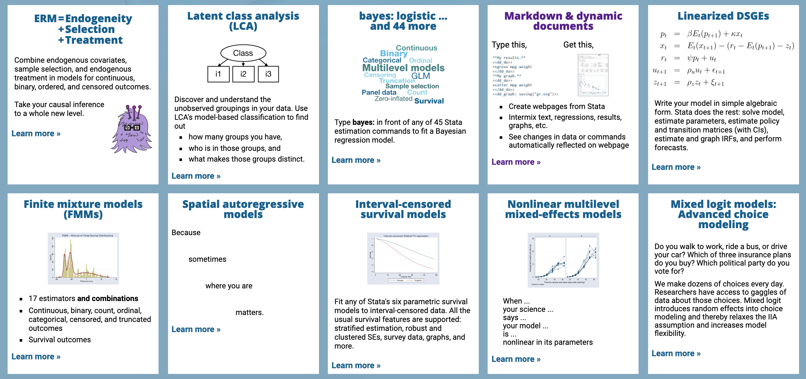

\mainmatter
# 导论

## 准备工作

[Stata](https://www.stata.com/) 是一款商业统计软件，你可以从 Stata 公司购买获得。最新版的 Stata 是 Stata 15.1，支持中界面文：

```{r stataui, echo=FALSE, fig.align='center', fig.cap = 'Stata15.1 界面', out.width='90%'}
knitr::include_graphics('assets/stataui.png')
```

目前为止，你需要知道Stata最直接的使用方法是从命令窗口输入代码，然后回车运行，结果会显示在结果窗口。

如果你需要写很多行代码，这种使用方式就不是一个好习惯了，为了研究的可重复性，你最好建立一个 do 文件，然后将你的代码一行行输入在 do 文档里保存：

```{r dofile, echo=FALSE, fig.align='center', fig.cap = 'Stata15.1 do 文档编辑器界面', out.width='70%'}

```

事实上，Stata 自带的这个编辑器并不好用，为了提高敲代码的效率，建议使用 Sublime Text3 编辑器。具体配置方法可以参考我的网站文章 [Stata安装与Sublime Text3配置教程](https://www.czxa.top/posts/59313/)。

```{r sublime, echo=FALSE, fig.align='center', fig.cap = 'Sublime Text3 界面', out.width='90%'}

```

你还可以从 [SublimeStataEnhanced](https://github.com/andrewheiss/SublimeStataEnhanced) 获取最新的配置方法。

## stata4ds 命令包

为了更方便的讲述，我开发了一个命令包，这个命令包涵盖了本书所需要的所有数据集和部分外部命令。你可以运行下面的 Stata 命令进行安装。

```stata 
* 首先需要安装 github 命令，这个命令可以用来安装 GitHub 上的 Stata 命令。
net install github, from("https://haghish.github.io/github/")
* 然后使用 github 命令安装 stata4ds
github install stata4ds, replace
```

除此之外之外，你还需要安装以下外部命令：

```stata 
* 安装 cuse 命令包
github install czxa/cuse, replace
* 安装 finance 命令包
github install czxa/finance, replace
* 安装 tidy 命令包
ssc install tidy, replace
* 安装 superscatter 命令
net install superscatter, from(http://digital.cgdev.org/doc/stata/MO/Misc) replace
...未完待续...
```

## 运行 Stata 代码

前面一节展示了一段 Stata 代码的运行结果，在本书中的代码是像这样的：

```stata 
display 1 + 2
*> 3
```

而你运行上面的代码之后，结果窗口显示的结果应该是这样的：

```stata 
. display 1 + 2
3
```

## 获取帮助

Stata 提供了非常详细完善的帮助文档，要查阅帮助文档，你可以使用 `help` 命令，例如查看 `clear` 的帮助文档：

```stata 
help clear
```

```{r clear, echo=FALSE, fig.align='center', fig.cap = 'clear 命令的帮助文档', out.width='60%'}
knitr::include_graphics('assets/clear.png')
```

Stata 还拥有着丰富的网络资源，你可以使用 `search` 和 `findit` 命令搜索，例如我想查找 `egen` 相关的内容：

```stata 
search egen
findit egen
```

Stata 官网上也有着丰富的 Stata 资源。此外，Stata15 比起前代的 Stata 有巨大的进步，如果你想了解 Stata15 的新功能，可以到 Stata 的官网查看：[New in Stata 15](https://www.stata.com/new-in-stata/)

```{r newinstata15, echo=FALSE, fig.align='center', fig.cap = 'Stata15 的新功能', out.width='90%'}

```


你还可以在 [Stata List](https://www.statalist.org/forums/) 和 [Stata Blog](https://blog.stata.com/) 获取 Stata 使用的资源和帮助。另外， [GitHub # Topic: stata](https://github.com/topics/stata) 上也有一些非常好用的 Stata 命令和学习资源。

下一章实际上并不是本书想要编排进来的内容，而是作者之前在担任计量经济学助教的时候编写的讲义，虽然比较粗略（毕竟讲义这种东西的目的只是帮助演讲者组织思路）。但是我相信通过下一章内容的学习，你将能够更轻松的进行本书的学习。因此特意将该讲义插入进来（其实只是想凑字数）。
