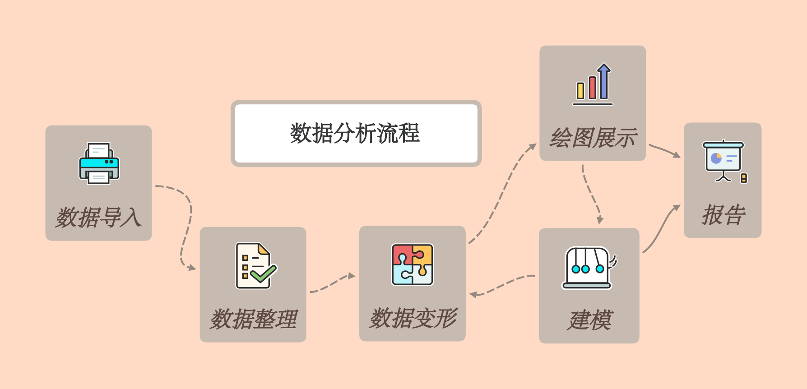

# 探索性分析

## 导论

本书第一部分的目标是让你尽快掌握数据探索的基本工具。数据分析的流程大致如下：

```{r datawf, echo=FALSE, fig.align='center', fig.cap = '数据分析的基本流程', out.width='90%'}

```

在这一部分你会学习到一些有用的工具：

1. 绘图是学习 Stata 的一个很好的开始，这是因为绘图能够最快地给使用者成就感。在数据可视化部分你讲学习到一些基本的绘图方法和一些有用的数据处理技巧。
2. 仅仅学习绘图是不够的，你还需要学习一些数据变换的方法，这样你才能根据自己的需要展示数据。
3. 最后，当你掌握了一些数据变换和绘图的方法之后，你就可以对一些实际案例进行分析了。

接下来的三章将分别介绍数据可视化、数据整理和数据探索性分析。
