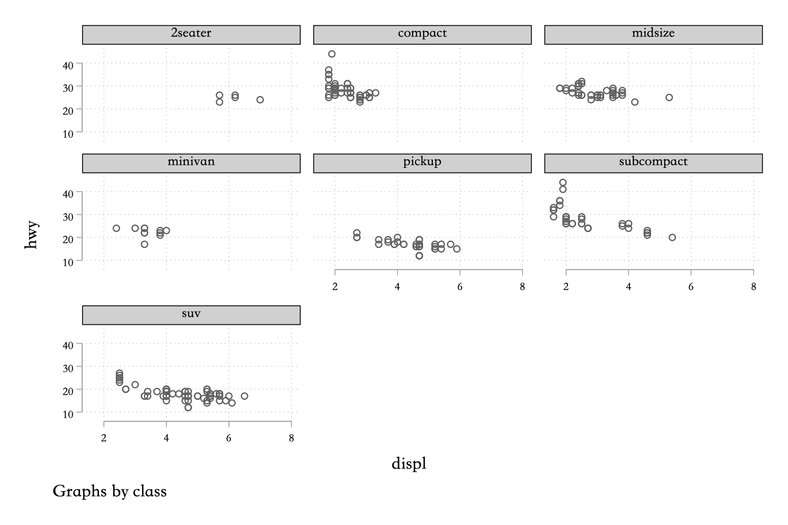
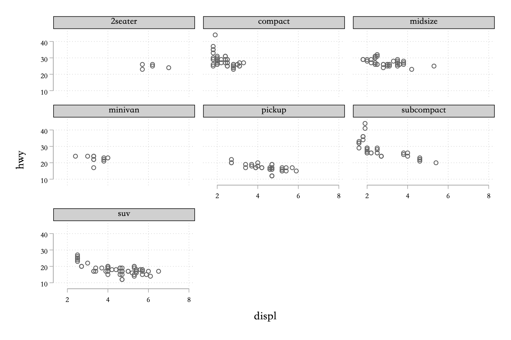

# 数据可视化
## 导论

> "The simple graph has brought more information to the data analyst’s mind than any other device." — John Tukey

本章将会向你介绍如何使用 Stata 进行绘图，Stata 的绘图方法比较接近图形语法。

## 准备工作

作者认为 Stata 的默认绘图主题不怎么好看，所以建议不要使用，推荐使用 plotplain 主题，安装方法如下：

```stata 
* 安装主题包
net install gr0070, from("http://www.stata-journal.com/software/sj17-3") replace
* 设置 plotplain 会默认绘图主题
set scheme plotplain, permanently
```

关于 Stata 绘图主题的选择，可以参考  [Scheming your way to your favorite graph style](https://blog.stata.com/2018/10/02/scheming-your-way-to-your-favorite-graph-style/) 和 [Stata的绘图主题](https://www.czxa.top/posts/24695/)。

## 第一步

让我们用图表回答这么一个问题：大排量的汽车是否比小排量的汽车使用更多的燃料？你可能已经有了答案，但是图表可以让你的答案更有说服力，发动机的功率和燃油效率之间的关系是怎样的，是正相关么？是线性的么？

### 读入 mpg 数据

这个数据集来源于 R 的 ggplot2 包，mpg 数据集包含了美国环保局收集的 38 种型号的汽车的数据：

```stata 
cd ~/Documents/我的项目/stata4ds/
sysuse mpg, clear
```

表 \@ref(tab:mpg) 展示了 mpg 数据集的一部分。

```{r mpg, echo=FALSE, fig.align='center', message=FALSE, warning=FALSE}
library(magrittr)
ggplot2::mpg %>% 
  dplyr::slice(1:10) %>% 
  knitr::kable(align = "c", 
               caption = 'mpg 数据概览',  
               booktabs = TRUE)
```


其中：
1. dipl 变量为发动机的排量，单位为升；
2. hwy 变量是汽车在高速公路上的燃油效率，以每加仑汽油前进英里数（mpg）计算。当行驶相同距离时，具有低燃油效率的汽车消耗更多的燃料。

### 创建散点图

`scatter` 命令的基本用法是 `scatter y x`，如图 \@ref(fig:hwydispl)：

```stata 
twoway scatter hwy displ
```

```{r hwydispl, echo=FALSE, fig.align='center', fig.cap='汽车排量与燃油效率', out.width='80%', fig.align='center'}
knitr::include_graphics('assets/hwydispl.png')
```

图 \@ref(fig:hwydispl) 显示了发动机排量和燃油效率之间的负相关关系，换句话来说，汽车的排量越高，燃油效率越低。

### 练习

1. 运行 `sc hwy displ`，你看到了什么？

> scatter 命令可以被简写为 sc, 当要绘制的图层只有一个时，twoway（可以简写为 tw）是可以省略的。

2. `mpg` 数据有多少行？多少列？

```stata 
sum
*>     Variable |        Obs        Mean    Std. Dev.       Min        Max
*> -------------+---------------------------------------------------------
*> manufacturer |          0
*>        model |          0
*>        displ |        234    3.471795    1.291959        1.6          7
*>         year |        234      2003.5    4.509646       1999       2008
*>          cyl |        234    5.888889    1.611534          4          8
*> -------------+---------------------------------------------------------
*>        trans |          0
*>          drv |          0
*>          cty |        234    16.85897    4.255946          9         35
*>          hwy |        234    23.44017    5.954643         12         44
*>           fl |          0
*> -------------+---------------------------------------------------------
*>        class |          0
```

可以看出 mpg 数据集有 11 个变量和 234 个观测值。除此之外，`count` 命令可以用于观测值计数：

```stata 
count
*> 234
```

`ds` 变量可以列示出符合条件的变量，默认列示出所有变量：

```stata 
ds
*> manufacturer  displ         cyl           drv           hwy           class
*> model         year          trans         cty           fl

* 查看上面命令运行产生的返回值
return list
*> macros:
*>     r(varlist) : "manufacturer model displ year cyl trans drv cty hwy fl c.."

* 返回值可以被后续的程序使用
di "`r(varlist)'"
*> manufacturer model displ year cyl trans drv cty hwy fl class

* `r(varlist)' 是一个字符串，wordcount() 函数可以用于计算字符串的中包含的单词个数
di wordcount("`r(varlist)'")
*> 11
```

关于 `ds` 命令的使用可以参考其帮助文档(help ds) 或者我的博客文章： [Stata中的变量名与标签#ds命令：列出符合条件的变量名称](https://www.czxa.top/posts/44612/#ds%E5%91%BD%E4%BB%A4%EF%BC%9A%E5%88%97%E5%87%BA%E7%AC%A6%E5%90%88%E6%9D%A1%E4%BB%B6%E7%9A%84%E5%8F%98%E9%87%8F%E5%90%8D%E7%A7%B0)

最后你还可以使用 c 类返回值 c(N) 和 c(k) 查看当前数据集的观测值个数和变量的个数。关于 c 类返回值的更多内容将会在下一章介绍。

```stata 
di c(N)
*> 74

di c(k)
*> 11
```

3. 如何查看变量 drv 的描述性统计？

```stata 
sum drv
*>     Variable |        Obs        Mean    Std. Dev.       Min        Max
*> -------------+---------------------------------------------------------
*>          drv |          0
```

这是因为 drv 是一个字符串变量，我们无法使用 summarize 变量对其进行描述性统计。不过 codeook 命令也能对变量进行描述：

```stata
codebook drv
*> ---------------------------------------------------------------------
*> drv                                                       (unlabeled)
*> ---------------------------------------------------------------------
*> 
*>                   type:  string (str1)
*> 
*>          unique values:  3                        missing "":  0/234
*> 
*>             tabulation:  Freq.  Value
*>                            103  "4"
*>                            106  "f"
*>                             25  "r"
```

从上面的结果可以看出，drv 变量是字符串变量、只有3种值，没有缺失值。`unlabeled` 表示该变量没有数值标签（help label）。

4. 制作 hwy 对 cyl 的散点图，如图 \@ref(fig:hwycyl)：

```stata
sc hwy cyl
```

```{r hwycyl, echo=FALSE, fig.align='center', fig.cap='hwy 和 cyl 的关系', out.width='80%', fig.align='center'}
knitr::include_graphics('assets/hwycyl.png')
```

5. 如果你绘制 class 变量和 drv 变量的散点图会发生什么？为什么？

```stata 
sc class drv
*> string variables not allowed in varlist;
*> class is a string variable
*> r(109);
```

这是因为 Stata 绘图中，字符串变量无法直接被转换成数值变量，所以不能直接用于绘图，所以我们需要首先把字符串变量转换成数值变量再进行绘图，如图 \@ref(fig:classnumdrvnum)：

```stata 
encode class, gen(classnum) label(class)
encode drv, gen(drvnum) label(drv)
sc classnum drvnum
```

```{r classnumdrvnum, echo=FALSE, fig.align='center', fig.cap='class 和 drv 的关系', out.width='80%', fig.align='center'}
knitr::include_graphics('assets/classnumdrvnum.png')
```

我们还可以使用变量的赋值标签作为轴标签，如图 \@ref(fig:classnumdrvnum2)：

```stata 
sc classnum drvnum, xlab(1 2 3, val) ylab(, val)
```

```{r classnumdrvnum2, echo=FALSE, fig.align='center', fig.cap='class 和 drv 的关系', out.width='80%', fig.align='center'}
knitr::include_graphics('assets/classnumdrvnum2.png')
```

这里使用了两个选项，xlab() 选项用于控制 x 轴的标签，`1 2 3` 表示 x 轴上只显示 `1 2 3` 三个标签，对应的赋值标签正好是 `4 f r`。val 是 xlab() 选项的选项，所以它的前面用逗号隔开，表示使用赋值标签作为轴标签。

## 散点图进阶 

> "The greatest value of a picture is when it forces us to notice what we never expected to see." — John Tukey

在图 \@ref(fig:hwydispl2) 中，用红色突出的点似乎超过了线性趋势，这些车的里程数高于我们的预期，这是为什么？

```stata
tw ///
sc hwy displ if displ < 5 | hwy < 22 || ///
sc hwy displ if displ > 5 & hwy > 22, mc(red) ||, ///
leg(off)
```
```{r hwydispl2, echo=FALSE, fig.align='center', fig.cap='排量与燃油效率关系中的一些异常值', out.width='80%', fig.align='center'}

```

这些异常值出现的一个可能的原因就是这些车中有混合动力车，检验这一猜想的办法就是查看每个 class 的 hwy，如图 \@ref(fig:hwydispl3)：

```stata 
* 查看 class 有哪些值
levelsof class
* 可以使用 local() 选项将这些值存储为一个 local 变量
levelsof class, local(class)
* 我们可以针对 class 的每一个值绘制一个图层：
tw ///
sc hwy displ if class == "2seater" || ///
sc hwy displ if class == "compact" || ///
sc hwy displ if class == "midsize" || ///
sc hwy displ if class == "minivan" || ///
sc hwy displ if class == "pickup" || ///
sc hwy displ if class == "subcompact" || ///
sc hwy displ if class == "suv" ||, ///
leg(order(1 "2seater" ///
		  2 "compact" ///
		  3 "midsize" ///
		  4 "minivan" ///
		  5 "pickup" ///
		  6 "subcompact" ///
		  7 "suv") title(class))
```

```{r hwydispl3, echo=FALSE, fig.align='center', fig.cap='不同类型汽车排量与燃油效率的关系', out.width='80%', fig.align='center'}
knitr::include_graphics('assets/hwydispl3.png')
```

这里使用的是不同的散点样式表示不同图层，当然我们也可以使用不同的颜色表示，`colorscheme` 命令是个非常好用的调色选色命令，其调色板来源于： [ColorBrewer: Color Advice for Maps](http://colorbrewer2.org/)，安装方式如下：

```stata 
net install colorscheme.pkg, from("https://github.com/matthieugomez/stata-colorscheme/raw/master/")
```

关于这个命令的使用，你可以参考其帮助文档（help colorscheme）或者我的博客文章： [colorscheme——调色选色命令](https://www.czxa.top/posts/16049/)。

我最喜欢的是 `Paired` 配色方案，如图 \@ref(fig:Paired)：

```stata
colorscheme 12, palette(Paired) display
return list
*> macros:
*>     r(color1) : "166 206 227"
*>     r(color2) : "031 120 180"
*>     r(color3) : "178 223 138"
*>     r(color4) : "051 160 044"
*>     r(color5) : "251 154 153"
*>     r(color6) : "227 026 028"
*>     r(color7) : "253 191 111"
*>     r(color8) : "255 127 000"
*>     r(color9) : "202 178 214"
*>    r(color10) : "106 061 154"
*>    r(color11) : "255 255 153"
*>    r(color12) : "177 089 040"
*>     r(colors) : ""166 206 227" "031 120 180"  "178 223 138"  "051 160 044.."
```

```{r Paired, echo=FALSE, fig.align='center', fig.cap='Paired 配色方案', out.width='80%', fig.align='center'}

```

这里我们需要 7 种颜色，如图 \@ref(fig:hwydispl4)：

```stata 
colorscheme 7, palette(Paired)
tw ///
sc hwy displ if class == "2seater", mc("`r(color1)'") ms(o) || ///
sc hwy displ if class == "compact", mc("`r(color2)'") ms(o) || ///
sc hwy displ if class == "midsize", mc("`r(color3)'") ms(o) || ///
sc hwy displ if class == "minivan", mc("`r(color4)'") ms(o) || ///
sc hwy displ if class == "pickup", mc("`r(color5)'") ms(o) || ///
sc hwy displ if class == "subcompact", mc("`r(color6)'") ms(o) || ///
sc hwy displ if class == "suv", mc("`r(color7)'") ms(o) ||, ///
leg(order(1 "2seater" ///
		  2 "compact" ///
		  3 "midsize" ///
		  4 "minivan" ///
		  5 "pickup" ///
		  6 "subcompact" ///
		  7 "suv") title(class))
```

```{r hwydispl4, echo=FALSE, fig.align='center', fig.cap='不同类型汽车排量与燃油效率的关系', out.width='80%', fig.align='center'}
knitr::include_graphics('assets/hwydispl4.png')
```

当然你也可以用散点的大小表示不同的图层，如图 \@ref(fig:hwydispl5)：

```stata 
colorscheme 7, palette(Set2)
tw ///
sc hwy displ if class == "2seater", mc("`r(color1)'") ms(o) msize(*1) || ///
sc hwy displ if class == "compact", mc("`r(color2)'") ms(o) msize(*1.5) || ///
sc hwy displ if class == "midsize", mc("`r(color3)'") ms(o) msize(*2) || ///
sc hwy displ if class == "minivan", mc("`r(color4)'") ms(o) msize(*2.5) || ///
sc hwy displ if class == "pickup", mc("`r(color5)'") ms(o) msize(*3) || ///
sc hwy displ if class == "subcompact", mc("`r(color6)'") ms(o) msize(*3.5) || ///
sc hwy displ if class == "suv", mc("`r(color7)'") ms(o) msize(*4) ||, ///
leg(order(1 "2seater" ///
		  2 "compact" ///
		  3 "midsize" ///
		  4 "minivan" ///
		  5 "pickup" ///
		  6 "subcompact" ///
		  7 "suv") title(class))
```

```{r hwydispl5, echo=FALSE, fig.align='center', fig.cap='不同类型汽车排量与燃油效率的关系', out.width='80%', fig.align='center'}
knitr::include_graphics('assets/hwydispl5.png')
```

最后 Stata15 在绘图方面引入了一个新特性就是可以为图层设置透明度了！关于透明度的使用可以参考 Stata 官网上的相关介绍和我的博客文章： [Stata15绘图的新功能：设置图形的透明度](https://www.czxa.top/posts/44086/)，图 \@ref(fig:hwydispl6)展示了使用透明度的效果：

```stata
/* 左图 */
tw ///
sc hwy displ if class == "2seater" || ///
sc hwy displ if class == "compact" || ///
sc hwy displ if class == "midsize" || ///
sc hwy displ if class == "minivan" || ///
sc hwy displ if class == "pickup" || ///
sc hwy displ if class == "subcompact" || ///
sc hwy displ if class == "suv" ||, ///
leg(order(1 "2seater" ///
		  2 "compact" ///
		  3 "midsize" ///
		  4 "minivan" ///
		  5 "pickup" ///
		  6 "subcompact" ///
		  7 "suv") title(class)) name(p1) nodraw
/* 右图 */
tw ///
sc hwy displ if class == "2seater", mc(%90) ms(o) || ///
sc hwy displ if class == "compact", mc(%80) ms(o) || ///
sc hwy displ if class == "midsize", mc(%70) ms(o) || ///
sc hwy displ if class == "minivan", mc(%60) ms(o) || ///
sc hwy displ if class == "pickup", mc(%50) ms(o) || ///
sc hwy displ if class == "subcompact", mc(%40) ms(o) || ///
sc hwy displ if class == "suv", mc(%30) ms(o) ||, ///
leg(order(1 "2seater" ///
		  2 "compact" ///
		  3 "midsize" ///
		  4 "minivan" ///
		  5 "pickup" ///
		  6 "subcompact" ///
		  7 "suv") title(class)) name(p2) nodraw
/* 合并 */
gr combine p1 p2
```

```{r hwydispl6, echo=FALSE, fig.align='center', fig.cap='不同类型汽车排量与燃油效率的关系', out.width='100%', fig.align='center', fig.subcap='左图是使用不同的散点样式，右图是使用不同的透明度'}
knitr::include_graphics('assets/hwydispl6.png')
```

Stata 绘图中的散点样式如图 \@ref(fig:symbolpalette)：

```stata 
palette symbolpalette
```

```{r symbolpalette, echo=FALSE, fig.align='center', fig.cap='Stata 绘图中的散点样式', out.width='80%', fig.align='center'}
knitr::include_graphics('assets/symbolpalette.png')
```

## 分面

把多个图层叠加在一起就会产生相互重叠的问题，因此我们有时候会选择将不同的图层分开绘制，也就是分面，如图 \@ref(fig:hwydisplbyclass)：

```stata 
sc hwy displ, by(class)
```

```{r hwydisplbyclass, echo=FALSE, fig.align='center', fig.cap='不同型号汽车排量与燃油效率的关系', out.width='100%', fig.align='center'}

```

我们也可以使用两个变量的组合进行分面，如图 \@ref(fig:hwydisplbyfrvcyl)：

```stata
sc hwy displ, by(drv cyl)
```

```{r hwydisplbyfrvcyl, echo=FALSE, fig.align='center', fig.cap='不同drv和cyl的汽车排量与燃油效率的关系', out.width='100%', fig.align='center'}
knitr::include_graphics('assets/hwydisplbyfrvcyl.png')
```

我们还可以自定义分面图的排列，例如全部排列在一行，如图 \@ref(fig:hwydisplbyclass2)：

```stata 
sc hwy displ, by(class, row(1))
```

```{r hwydisplbyclass2, echo=FALSE, fig.align='center', fig.cap='不同型号汽车排量与燃油效率的关系', out.width='100%', fig.align='center'}
knitr::include_graphics('assets/hwydisplbyclass2.png')
```

经常有小伙伴在绘制分面图的时候想把左下角的 `Graphs by xx` 去掉，这个可以通过 `by()` 的子选项去除：

```stata
sc hwy displ, by(class, note(""))
```

```{r hwydisplbyclass3, echo=FALSE, fig.align='center', fig.cap='不同型号汽车排量与燃油效率的关系', out.width='100%', fig.align='center'}

```

## 几何对象

观察图 \@ref(fig:lpolychwydisp) 中的两个图层，什么相似的地方？

```stata 
tw ///
sc hwy displ || ///
lpolyci hwy disp
```

```{r lpolychwydisp, echo=FALSE, fig.align='center', fig.cap='汽车排量与燃油效率的关系散点图与多项式拟合', out.width='90%', fig.align='center'}
knitr::include_graphics('assets/lpolychwydisp.png')
```

可以看出两个图层有着相同的x和y变量，也正是因此我们才能把这两个图层叠加在一起。但是一个是用散点表示两者的关系，一个是用多项式拟合线表示两者的关系，也就是说，两个图层使用了不同的几何对象。

人们经常会根据实际需要使用不同的几何对象表示数据，例如展示数据分布常使用直方图、箱线图，展示走势常使用线图等等。

图 \@ref(fig:lpolycibydrv) 展示了针对不同的 drv 值绘制不同的曲线拟合：

```stata
tw ///
lpolyci hwy displ if drv == "4", lp(solid) || ///
lpolyci hwy displ if drv == "f", lp(dash) || ///
lpolyci hwy displ if drv == "r", lp(shortdash) ||, ///
leg(order(2 "4" 4 "f" 6 "r") title(drv))
```

```{r lpolycibydrv, echo=FALSE, fig.align='center', fig.cap='不同 drv 的汽车排量与燃油效率的关系', out.width='90%', fig.align='center'}
knitr::include_graphics('assets/lpolycibydrv.png')
```

这里需要补充的是，Stata中的线型有以下几种，如图 \@ref(fig:linepalette)：
```stata 
palette linepalette
```

```{r linepalette, echo=FALSE, fig.align='center', fig.cap='Stata 中的线型', out.width='90%', fig.align='center'}

```

为了更容易区分，我们再对不同的图层使用不同的颜色，如图 \@ref(fig:lpolycibydrv2)：

```stata
colorscheme 3, palette("Set2")
return list
tw ///
lpolyci hwy displ if drv == "4", lc("`r(color1)'") || ///
lpolyci hwy displ if drv == "f", lc("`r(color2)'") || ///
lpolyci hwy displ if drv == "r", lc("`r(color3)'") || ///
sc hwy displ if drv == "4", mc("`r(color1)'") || ///
sc hwy displ if drv == "f", mc("`r(color2)'") || ///
sc hwy displ if drv == "r", mc("`r(color3)'") ||, ///
leg(order(2 "4" 4 "f" 6 "r") title(drv))
```

```{r lpolycibydrv2, echo=FALSE, fig.align='center', fig.cap='不同 drv 的汽车排量与燃油效率的关系', out.width='90%', fig.align='center'}
knitr::include_graphics('assets/lpolycibydrv2.png')
```

Stata 的绘图功能是比较强大的，事实上我觉得如果一个绘图系统能够绘制不同颜色的点、线和区域，那么它就能够绘制任何图，而绘图的难易程度取决于绘图函数的设计。

图 \@ref(fig:lpolycihwydispl) 展示了不同 class 的汽车排量与燃油效率的关系：


```stata 
colorscheme 8, palette(Set2)
tw ///
sc hwy displ if class == "2seater", mc("`r(color1)'") ms(o) || ///
sc hwy displ if class == "compact", mc("`r(color2)'") ms(o) || ///
sc hwy displ if class == "midsize", mc("`r(color3)'") ms(o) || ///
sc hwy displ if class == "minivan", mc("`r(color4)'") ms(o) || ///
sc hwy displ if class == "pickup", mc("`r(color5)'") ms(o) || ///
sc hwy displ if class == "subcompact", mc("`r(color6)'") ms(o) || ///
sc hwy displ if class == "suv", mc("`r(color7)'") ms(o) || ///
lpolyci hwy displ, lc("`r(color8)'") ||, ///
leg(order(1 "2seater" ///
		  2 "compact" ///
		  3 "midsize" ///
		  4 "minivan" ///
		  5 "pickup" ///
		  6 "subcompact" ///
		  7 "suv") title(class))
```

```{r lpolycihwydispl, echo=FALSE, fig.align='center', fig.cap='不同 class 的汽车排量与燃油效率的关系', out.width='90%', fig.align='center'}
knitr::include_graphics('assets/lpolycihwydispl.png')
```

当然也可以对 class 的一个子集进行多项式拟合，如图 \@ref(fig:lpolycihwydispl2)：

```stata 
colorscheme 8, palette(Set2)
tw ///
sc hwy displ if class == "2seater", mc("`r(color1)'") ms(o) || ///
sc hwy displ if class == "compact", mc("`r(color2)'") ms(o) || ///
sc hwy displ if class == "midsize", mc("`r(color3)'") ms(o) || ///
sc hwy displ if class == "minivan", mc("`r(color4)'") ms(o) || ///
sc hwy displ if class == "pickup", mc("`r(color5)'") ms(o) || ///
sc hwy displ if class == "subcompact", mc("`r(color6)'") ms(o) || ///
sc hwy displ if class == "suv", mc("`r(color7)'") ms(o) || ///
lpolyci hwy displ if class == "subcompact", lc("`r(color8)'") ||, ///
leg(order(1 "2seater" ///
		  2 "compact" ///
		  3 "midsize" ///
		  4 "minivan" ///
		  5 "pickup" ///
		  6 "subcompact" ///
		  7 "suv") title(class))
```

```{r lpolycihwydispl2, echo=FALSE, fig.align='center', fig.cap='不同 class 的汽车排量与燃油效率的关系', out.width='90%', fig.align='center'}
knitr::include_graphics('assets/lpolycihwydispl2.png')
```

## 统计变换

Stata 绘制直方图的命令是 `histogram` ，简写为 `hist`，如图 \@ref(fig:histcut)：

```stata 
sysuse diamonds, clear
hist cut, barwidth(0.8) xlab(, val) freq
```

```{r histcut, echo=FALSE, fig.align='center', fig.cap='钻石切工分布直方图', out.width='80%', fig.align='center'}
knitr::include_graphics('assets/histcut.png')
```

我们可以注意到，图 \@ref(fig:histcut) 中的横轴是 cut 变量，纵轴是 cut 变量各个取值的分布，而我们主要到数据集中是没有这个变量的，显然这个变量是 hist 命令计算过程中生成的，下面的语句展示了如何对 cut 变量的各个取值进行计数然后绘制直方图，如图 \@ref(fig:barcut)：

```stata 
contract cut
tw bar _freq cut, barwidth(0.8) xlab(, val)
```

```{r barcut, echo=FALSE, fig.align='center', fig.cap='钻石切工分布直方图', out.width='80%', fig.align='center'}
knitr::include_graphics('assets/barcut.png')
```

contract 命令能够快速的对变量进行计数，详细用法可以参考其帮助文档（help contract）或者我的博客文章： [Stata旧笔记整理（八）#contract命令](https://www.czxa.top/posts/1170/#contract%E5%91%BD%E4%BB%A4)。

contract 命令运行之后会生成一个新的数据集，如表 \@ref(tab:cut)：

```{r cut, echo=FALSE}
cut <- tribble(
  ~ cut, ~`_freq`,
  "Fair", 1610,
  "Good", 4906,
  "Very Good", 12082,
  "Premium", 13791,
  "Ideal", 21551
)
knitr::kable(
  cut, caption = 'contract cut 的结果',
  booktabs = TRUE
)
```


通过这个过程你就会发现所谓的 `统计变换` 不过就是把一系列的计算过程封装在命令中，并不难懂。

`hist` 命令的纵轴也可以为频率（Density），去掉 freq 选项即可，如图 \@ref(fig:histcut2)：

```stata 
sysuse diamonds, clear
hist cut, barwidth(0.8) xlab(, val)
```

```{r histcut2, echo=FALSE, fig.align='center', fig.cap='钻石切工分布直方图', out.width='80%', fig.align='center'}

```

统计变换经常是件苦力活，因为很多时候我们需要先计算我们需要进行的统计变换，然后再把变换后的结果整理好读入Stata再绘图，`collapse` 是一个非常好用的命令，可以帮我们简化这个过程，例如我想展示不同cut值depth变量的范围和中位数：

```stata 
sysuse diamonds, clear
collapse 	(min) depthmin = depth ///
			(median) depthmedian = depth ///
			(max) depthmax = depth, by(cut)
```

这个时候得到的结果见表 \@ref(tab:depthmmm)：

```{r depthmmm, echo=FALSE}
tribble(
  ~cut, ~depthmin, ~depthmedian, ~depthmax,
  "Fair", 43, 65,79,
  "Good", 54.3, 63.4,67,
  "Very Good", 56.8, 62.1,64.9,
  "Premium", 58, 61.4,63,
  "Ideal", 43, 61.8,66.7
) %>% 
  knitr::kable(
    caption = 'collapse depth 的结果',
    booktabs = TRUE
)
```

然后我们再绘图，绘图结果见图 \@ref(fig:depth3m)：

```stata 
tw ///
rspike depthmax depthmin cut || ///
sc depthmedian cut, xlab(, val) ms(O) mc(black) ||, ///
leg(off)
```

```{r depth3m, echo=FALSE, fig.align='center', fig.cap='钻石深度的分布', out.width='80%', fig.align='center'}

```

## 位置调整

通过不同的颜色设置，我们可以得到下面的图 \@ref(fig:barcutmulticolor) 和图 \@ref(fig:barcutmulticolor2)：

```stata
sysuse diamonds, clear
contract cut
colorscheme 5, palette(Set2)
tw ///
bar _freq cut if cut == 1, fc("`r(color1)'") barwidth(0.8) || ///
bar _freq cut if cut == 2, fc("`r(color2)'") barwidth(0.8) || ///
bar _freq cut if cut == 3, fc("`r(color3)'") barwidth(0.8) || ///
bar _freq cut if cut == 4, fc("`r(color4)'") barwidth(0.8) || ///
bar _freq cut if cut == 5, fc("`r(color5)'") ///
barwidth(0.8) xlab(, val) leg(off)
```

```{r barcutmulticolor, echo=FALSE, fig.align='center', fig.cap='钻石切工的分布', out.width='80%', fig.align='center'}
knitr::include_graphics('assets/barcutmulticolor.png')
```

```stata 
sysuse diamonds, clear
contract cut
colorscheme 5, palette(Set1)
tw ///
bar _freq cut if cut == 1, lc("`r(color1)'") barwidth(0.8) || ///
bar _freq cut if cut == 2, lc("`r(color2)'") barwidth(0.8) || ///
bar _freq cut if cut == 3, lc("`r(color3)'") barwidth(0.8) || ///
bar _freq cut if cut == 4, lc("`r(color4)'") barwidth(0.8) || ///
bar _freq cut if cut == 5, lc("`r(color5)'") ///
barwidth(0.8) xlab(, val) leg(off)
```

```{r barcutmulticolor2, echo=FALSE, fig.align='center', fig.cap='钻石切工的分布', out.width='80%', fig.align='center'}
knitr::include_graphics('assets/barcutmulticolor2.png')
```

两幅图的区别就在于，第一幅图是使用 `fc()` 选项，这个选项控制对直方条的填充色，第二幅图使用的是 `lc()` 选项，这个选项控制直方条边缘的颜色。

实际上，上面两幅图关于颜色的设置都是没有什么实际意义的，只是让图看起来更加炫酷。但是有时候我们想知道例如“我们班的男生和女生生源地分布”这种问题的答案，这个时候使用颜色填充就有意义了，例如图 \@ref(fig:stackcutclarity)钻石不同切工的克拉分布：

```stata
sysuse diamonds, clear
colorscheme 8, palette(Paired)
gr bar, over(clarity) over(cut) ///
	stack asyvars yti(count) ///
	leg(ti(clarity)) ///
	bar(1, color("`r(color1)'")) ///
	bar(2, color("`r(color2)'")) ///
	bar(3, color("`r(color3)'")) ///
	bar(4, color("`r(color4)'")) ///
	bar(5, color("`r(color5)'")) ///
	bar(6, color("`r(color6)'")) ///
	bar(7, color("`r(color7)'")) ///
	bar(8, color("`r(color8)'"))
```

```{r stackcutclarity, echo=FALSE, fig.align='center', fig.cap='钻石不同切工的克拉分布', out.width='80%', fig.align='center'}
knitr::include_graphics('assets/stackcutclarity.png')
```

有时候我们会绘制图 \@ref(fig:histautoprice)：

```stata 
sysuse auto, clear
tw ///
hist price if for || ///
hist price if !for
```
```{r histautoprice, echo=FALSE, fig.align='center', fig.cap='国产车和进口车的价格分布', out.width='80%', fig.align='center'}
knitr::include_graphics('assets/histautoprice.png')
```

这个图的问题就是相互重叠问题很严重，为此我们可以采取下面两种方法解决这个问题，第一种是将位于上层的图层设置为透明的，如图 \@ref(fig:histautoprice2)：

```stata 
tw ///
hist price if for, fc(red) || ///
hist price if !for, fc(green%50) ///
	leg(order(1 "进口车" 2 "国产车"))
```

```{r histautoprice2, echo=FALSE, fig.align='center', fig.cap='国产车和进口车的价格分布', out.width='80%', fig.align='center'}
knitr::include_graphics('assets/histautoprice2.png')
```

第二中方法是不再给柱形图填充颜色，如图 \@ref(fig:histautoprice3)：

```stata 
tw ///
hist price if for, fc(red) lc(red) || ///
hist price if !for, color(none) lc(green) ///
	leg(order(1 "进口车" 2 "国产车"))
```

```{r histautoprice3, echo=FALSE, fig.align='center', fig.cap='国产车和进口车的价格分布', out.width='80%', fig.align='center'}

```

位置调整有三种，用 ggplot2 的话来说，分别是 `identity`、`fill` 和 `dodge`。刚刚绘制的图 \@ref(fig:stackcutclarity)就是 `identity` 模式。除此之外，`fill` 模式为，如图 \@ref(fig:percentcutclarity)：

```stata 
sysuse diamonds, clear
gen id = _n
colorscheme 8, palette(Paired)
gr bar (count) id, over(clarity) over(cut) ///
	stack asyvars yti(count) ///
	leg(ti(clarity)) ///
	bar(1, color("`r(color1)'")) ///
	bar(2, color("`r(color2)'")) ///
	bar(3, color("`r(color3)'")) ///
	bar(4, color("`r(color4)'")) ///
	bar(5, color("`r(color5)'")) ///
	bar(6, color("`r(color6)'")) ///
	bar(7, color("`r(color7)'")) ///
	bar(8, color("`r(color8)'")) ///
	percent
```

```{r percentcutclarity, echo=FALSE, fig.align='center', fig.cap='钻石不同切工的克拉分布', out.width='80%', fig.align='center'}
knitr::include_graphics('assets/percentcutclarity.png')
```

最后，`dodge` 模式为，如图 \@ref(fig:dodgecutclarity)：

```stata 
sysuse diamonds, clear
gen id = _n
colorscheme 8, palette(Paired)
gr bar (count) id, over(clarity) over(cut) ///
	asyvars yti(count) ///
	leg(ti(clarity)) ///
	bar(1, color("`r(color1)'")) ///
	bar(2, color("`r(color2)'")) ///
	bar(3, color("`r(color3)'")) ///
	bar(4, color("`r(color4)'")) ///
	bar(5, color("`r(color5)'")) ///
	bar(6, color("`r(color6)'")) ///
	bar(7, color("`r(color7)'")) ///
	bar(8, color("`r(color8)'"))
```
```{r dodgecutclarity, echo=FALSE, fig.align='center', fig.cap='钻石不同切工的克拉分布', out.width='80%', fig.align='center'}
knitr::include_graphics('assets/dodgecutclarity.png')
```

其它类型的图其实也有位置的调整，不过不如直方图有用，例如散点图增加扰动，如图 \@ref(fig:scjitter)：

```stata
sysuse mpg, clear
sc hwy displ, name(p1, replace) ti(没有添加散点扰动)
sc hwy displ, name(p2, replace) jitter(3)  ti(添加了散点扰动)
gr combine p1 p2
```

```{r scjitter, echo=FALSE, fig.align='center', fig.cap='增加散点扰动的效果图', out.width='80%', fig.align='center'}
knitr::include_graphics('assets/scjitter.png')
```

很容易理解，增加散点扰动也是缓解散点重叠问题的一种办法。前面的使用透明度也是一种方法，如图 \@ref(fig:scopc)。

```{r scopc, echo=FALSE, fig.align='center', fig.cap='使用透明度的效果图', out.width='80%', fig.align='center'}
knitr::include_graphics('assets/scopc.png')
```

这里再介绍两种减缓散点重叠问题的方法：

方法1: 使用 flower命令，如图 \@ref(fig:flower)：

```stata 
* 安装：
ssc install flower
flower hwy displ
```

```{r flower, echo=FALSE, fig.align='center', fig.cap='使用太阳花的花瓣数量表示重叠程度', out.width='80%', fig.align='center'}
knitr::include_graphics('assets/flower.png')
```

实际上，Stata官方也提供了绘制太阳花的命令，如图 \@ref(fig:sunflower)：

```stata 
sunflower hwy displ
*> Bin width          =       .36
*> Bin height         =   2.65899
*> Bin aspect ratio   =   6.39655
*> Max obs in a bin   =        12
*> Light              =         3
*> Dark               =        13
*> X-center           =       3.3
*> Y-center           =        24
*> Petal weight       =         1
*> ------------------------------------------------------------------
*>      flower      petal     No. of     No. of  estimated     actual
*>        type     weight     petals    flowers       obs.       obs.
*> ------------------------------------------------------------------
*>        none                                          46         46
*>       light          1          3          6         18         18
*>       light          1          4          7         28         28
*>       light          1          5          8         40         40
*>       light          1          6          2         12         12
*>       light          1          7          3         21         21
*>       light          1          8          2         16         16
*>       light          1          9          1          9          9
*>       light          1         10          1         10         10
*>       light          1         11          2         22         22
*>       light          1         12          1         12         12
*> ------------------------------------------------------------------
*>                                                     234        234
```

```{r sunflower, echo=FALSE, fig.align='center', fig.cap='使用太阳花的花瓣数量表示重叠程度', out.width='80%', fig.align='center'}
knitr::include_graphics('assets/sunflower.png')
```

另一种方法是使用 [E. F. Haghish](https://github.com/haghish) 开发的 [neat](https://github.com/haghish/neat) 命令，如图 \@ref(fig:neatscatter)：

```stata
* 安装 neat 命令
github install haghish/neat, replace
sysuse mpg, clear
neat hwy displ
sc hwy displ
```

```{r neatscatter, echo=FALSE, fig.align='center', fig.cap='使用太阳花的花瓣数量表示重叠程度', out.width='80%', fig.align='center'}
knitr::include_graphics('assets/neatscatter.png')
```

需要注意的是，neat并不是绘图的命令，而是一个修改数据的命令。

关于 neat 命令的详细使用介绍可以参考其 GitHub 仓库： [haghish/neat](https://github.com/haghish/neat)

## 坐标系统

Stata 绘图中坐标系统的调整主要是横纵坐标的交换，如图 \@ref(fig:boxcombine)：

```stata
sysuse mpg, clear
gr box hwy, over(class) ti("绘图命令：gr box hwy, over(class)") ///
	name(p1, replace)
gr hbox hwy, over(class)  ti("绘图命令：gr hbox hwy, over(class)") ///
	name(p2, replace)
gr combine p1 p2
```

```{r boxcombine, echo=FALSE, fig.align='center', fig.cap='竖直箱线图与水平箱线图', out.width='80%', fig.align='center'}

```

另一种常用的坐标系调整是纵轴和横轴尺度的比例，使用 `aspectratio()` 选项调整，例如我想设置纵轴和横轴的比例是 1:2，如图 \@ref(fig:aspscatter)：

```stata 
sysuse mpg, clear
sc hwy displ, aspect(0.5)
```

```{r aspscatter, echo=FALSE, fig.align='center', fig.cap='aspectratio() 选项的使用', out.width='80%', fig.align='center'}

```

Stata 中并没有直接的坐标系转换机制（这就不像 ggplot2 中那么方便了），但是 Stata 中有绘制各种图的命令，以上展示的图基本都是基于笛卡尔坐标系的，基于极坐标系的饼图在 Stata 中可以直接使用 pie 命令绘制，如图 \@ref(fig:barpluspie)：

```stata 
sysuse diamonds, clear
contract cut
colorscheme 5, palette(Paired)
tw ///
bar _freq cut if cut == 1, horizontal fc("`r(color1)'") lc("`r(color1)'") || ///
bar _freq cut if cut == 2, horizontal fc("`r(color2)'") lc("`r(color2)'") || ///
bar _freq cut if cut == 3, horizontal fc("`r(color3)'") lc("`r(color3)'") || ///
bar _freq cut if cut == 4, horizontal fc("`r(color4)'") lc("`r(color4)'") || ///
bar _freq cut if cut == 5, horizontal fc("`r(color5)'") lc("`r(color5)'") ///
	ylab(, val) name(p1, replace) nodraw leg(off)

sysuse diamonds, clear
colorscheme 5, palette(Paired)
gr pie, over(cut) ///
	pie(1, color("`r(color1)'")) ///
	pie(2, color("`r(color2)'")) ///
	pie(3, color("`r(color3)'")) ///
	pie(4, color("`r(color4)'")) ///
	pie(5, color("`r(color5)'")) ///
	name(p2, replace) leg(off) ///
	pl(1 name) ///
	pl(2 name) ///
	pl(3 name) ///
	pl(4 name) ///
	pl(5 name) nodraw
gr combine p1 p2
```

```{r barpluspie, echo=FALSE, fig.align='center', fig.cap='graph bar 和 graph pie 命令的使用', out.width='80%', fig.align='center'}

```

这里我们使用了一个新的选项 `horizontal`，这个选项控制图像的水平显示。

最后我们再回到 `aspectratio()` 选项上，经常我们需要在图像中添加一条45线，例如绘制 QQ 图的时候就需要添加一条45度线，这个时候使用 `aspect(1)` 可以保证这条45度线是真的45度线，如图 \@ref(fig:qnorm)：

```stata 
qnorm depth, aspect(1) xlab(40(10)80) ylab(40(10)80)
```

```{r qnorm, echo=FALSE, fig.align='center', fig.cap='depth 变量的 QQ 图', out.width='80%', fig.align='center'}

```
