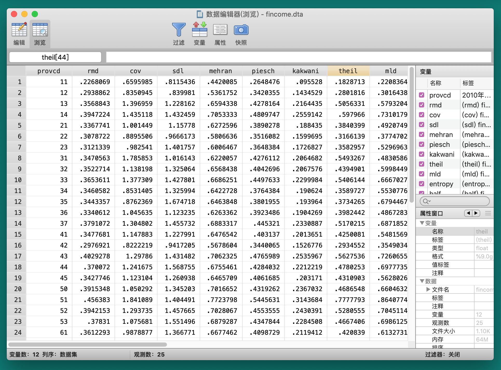

# 工作流程：基础

相信经过前面几章的学习，你已经拥有了一定的 Stata 基础，尽管我没有讲述太多细节。当你刚开始使用 Stata 编程的时候，感到沮丧是很正常的，克服它的唯一办法就是继续努力学习。

在我们进一步讨论之前，让我们先确保你在运行 Stata 代码方面又一个坚实的基础，并且你知道一些最有用的 Stata 功能。

## 编程的基础知识

让我们回顾一下迄今为止省略的一些基础知识，以便尽快让你进行绘图。你可以使用 Stata 作为计算器：

```stata 
di 1 / 200 * 30
*> .15
di (59 + 73 + 2) / 3
*> 44.666667
di sin(c(pi) / 2)
*> 1
```

注意，在 Stata 中，有一类常量叫 c 类返回值（creturn），你可以运行 `help creturn` 查看其帮助文档，例如：

```stata 
sysuse mpg, clear

* 查看当前日期
di c(current_date)
*> 17 Apr 2019

* 查看当前时间
di c(current_time)
*> 09:57:47

* 查看 PLUS 文件夹的位置
di c(sysdir_plus)
*> /Users/czx/Library/Application Support/Stata/ado/plus/

* 查看当前工作目录的位置
di c(pwd)
*> /Users/czx/Documents/我的项目/stata4ds

* 查看当前数据集的观测值个数
di c(N)
*> 234

 * 查看当前数据集的变量个数
di c(k)
*> 11

* 查看当前数据集的文件名
di c(filename)
*> mpg.dta

* 查看当前绘图主题
di c(scheme)
*> plotplain

* 查看小写字母表
di c(alpha)
*> a b c d e f g h i j k l m n o p q r s t u v w x y z

* 查看大写字母表
di c(ALPHA)
*> A B C D E F G H I J K L M N O P Q R S T U V W X Y Z

* 查看简写月份表
di c(Mons)
*> Jan Feb Mar Apr May Jun Jul Aug Sep Oct Nov Dec

* 查看全称月份表
di c(Months)
*> January February March April May June July August September October November December

* 查看简写星期表
di c(Wdays)
*> Sun Mon Tue Wed Thu Fri Sat

* 查看全称星期表
di c(Weekdays)
*> Sunday Monday Tuesday Wednesday Thursday Friday Saturday
```

我们可以在自己的程序里使用这些 c 类值。例如，我想输出大小写字母表：

```stata 
local Aa = "Aa"
local alphanum = wordcount("`c(alpha)'")
forval i = 1/`alphanum'{
	local temp = word("`c(ALPHA)'", `i') + word("`c(alpha)'", `i')
	local Aa = "`Aa' `temp'"
}
di "`Aa'"
*> Aa Aa Bb Cc Dd Ee Ff Gg Hh Ii Jj Kk Ll Mm Nn Oo Pp Qq Rr Ss Tt Uu Vv Ww Xx Yy Zz
```

你可以使用 local 和 global 关键字创建宏变量：

```stata 
local x = 3 * 4
di `x'
*> 12

global x = 3 * 4
di $x
*> 12
```

Stata 中的宏变量类型还有很多，你可以运行 `help macro` 查看帮助文档，通过前几章的学习你应该已经发现了，我最常使用的是 `local`。

## Stata 的变量名

Stata 中的变量名可以是下面这些形式的：

```stata 
        x
        myvar
        Myvar
        inc92
        ausländisch
        reciprocal_of_miles_per_gallon
        _odd
        _1994
```

Stata 的变量调用时可以使用通配符，这意味着下面的两段代码的作用是一样的：

```stata 
sysuse auto, clear
sum foreign
*>     Variable |        Obs        Mean    Std. Dev.       Min        Max
*> -------------+---------------------------------------------------------
*>      foreign |         74    .2972973    .4601885          0          1

sum for
*>     Variable |        Obs        Mean    Std. Dev.       Min        Max
*> -------------+---------------------------------------------------------
*>      foreign |         74    .2972973    .4601885          0          1

list m* in 1/5
*>    +---------------------+
*>    | make            mpg |
*>    |---------------------|
*> 1. | AMC Concord      22 |
*> 2. | AMC Pacer        17 |
*> 3. | AMC Spirit       22 |
*> 4. | Buick Century    20 |
*> 5. | Buick Electra    15 |
*>    +---------------------+
```

与变量名有关的更多内容可以运行 `help varname` 查看帮助文档。

## 调用函数

Stata 中内置了很多函数，例如我们前面使用的 wordcount() 和 word()。下面我们来看一些例子：

```stata 
clear all
set obs 10
gen a = _n
egen b = fill(1 2 3)
egen c = seq(), from(1) to(10)
list
*>    +--------------+
*>    |  a    b    c |
*>    |--------------|
*> 1. |  1    1    1 |
*> 2. |  2    2    2 |
*> 3. |  3    3    3 |
*> 4. |  4    4    4 |
*> 5. |  5    5    5 |
*>    |--------------|
*> 6. |  6    6    6 |
*> 7. |  7    7    7 |
*> 8. |  8    8    8 |
*> 9. |  9    9    9 |
*>10. | 10   10   10 |
*>    +--------------+
```

关于 egen 函数的更多用法可以运行 `help egen` 参考其帮助文档。也可以参考我的网站文章：[Stata中的egen函数](https://www.czxa.top/posts/18884/)。这篇文章几乎搜集了所有的 egen 函数。

```stata 
clear all
set obs 5
egen a = fill(1 3.25)
list a
*>    +------+
*>    |    a |
*>    |------|
*> 1. |    1 |
*> 2. | 3.25 |
*> 3. |  5.5 |
*> 4. | 7.75 |
*> 5. |   10 |
*>    +------+
```

## 实践

我曾经遇到过这样一个问题，经过对 [CHFS](https://chfs.swufe.edu.cn/) 数据的处理，我得到了每个家庭的人口数、年收入，然后我想计算每个省的基尼系数。我把处理之后的数据存放在我的 cuse 数据库里面了:

```stata 
cuse fincome, clear web
* 或者
sysuse fincome, clear
list in 1/10
*>    +--------------------------------+
*>    |    fid   fnum   year   fincome |
*>    |--------------------------------|
*> 1. | 110003      3   2012    100000 |
*> 2. | 110006      3   2012     77180 |
*> 3. | 110009      7   2012     98200 |
*> 4. | 110011      5   2012     76000 |
*> 5. | 110013      3   2012    116000 |
*>    |--------------------------------|
*> 6. | 110015      3   2012     30000 |
*> 7. | 110020      6   2012     92000 |
*> 8. | 110021      2   2012     64800 |
*> 9. | 110022      4   2012    130000 |
*>10. | 110023      2   2012    127640 |
*>    +--------------------------------+
```

家庭变量的前两位是省份编号，我们可以使用下面的代码生成一个省份变量：

```stata 
tostring fid, gen(provcd)
replace provcd = substr(provcd, 1, 2)
destring provcd, replace
```

其中，`fid` 变量是家庭的编号、`fnum` 变量是家庭的人口数，`year` 是调查数据的年份，`fincome` 是该家庭的年收入。

为了计算不平等度，我们需要安装 `egen_inequal.pkg` 命令包：

```stata 
net install egen_inequal.pkg, from("http://fmwww.bc.edu/RePEc/bocode/e/")
```

该命令的使用方法是：

```stata
egen rmd = inequal(fincome), index(rmd) weight(fnum) by(provcd)
egen cov = inequal(fincome), index(cov) weight(fnum) by(provcd)
egen sdl = inequal(fincome), index(sdl) weight(fnum) by(provcd)
egen mehran = inequal(fincome), index(mehran) weight(fnum) by(provcd)
egen piesch = inequal(fincome), index(piesch) weight(fnum) by(provcd)
egen kakwani = inequal(fincome), index(kakwani) weight(fnum) by(provcd)
egen theil = inequal(fincome), index(theil) weight(fnum) by(provcd)
egen mld = inequal(fincome), index(mld) weight(fnum) by(provcd)
egen entropy = inequal(fincome), index(entropy) weight(fnum) by(provcd)
egen half = inequal(fincome), index(half) weight(fnum) by(provcd)
egen gini = inequal(fincome), index(gini) weight(fnum) by(provcd)
```

其中 index 选项的参数的含义为：

index选项的参数 | 指标含义 | 中文
:---:|:---: | :---:
rmd    |    the relative mean deviation |相对均差
cov    |    the coefficient of variation |变异系数
sdl     |   the standard deviation of logs |对数标准差
gini    |   the Gini index |基尼指数
mehran   |  the Mehran index |Mehran指数
piesch  |   the Piesch index |Piesch指数
kakwani  |  the Kakwani index |Kakwani 指数
theil   |   Theil entropy index | 泰尔熵指数
mld    |    the mean log deviation |对数均值偏差
entropy  |  generalized entropy measure (GE -1) | 广义熵测度-1
half   |    generalized entropy measure (GE 2) |广义熵测度-2

为每个省保留一个观测值：

```stata 
duplicates drop provcd, force
keep provcd rmd-half
```

```{r gini, echo=FALSE, fig.align='center', fig.cap='各省的收入不平等度度', out.width='90%', fig.align='center'}

```
