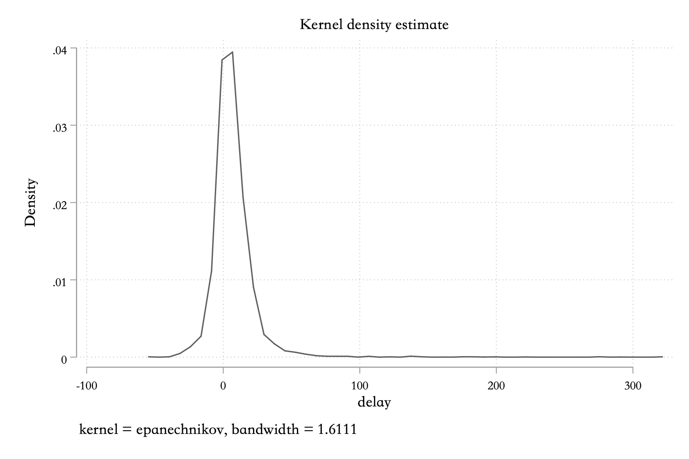
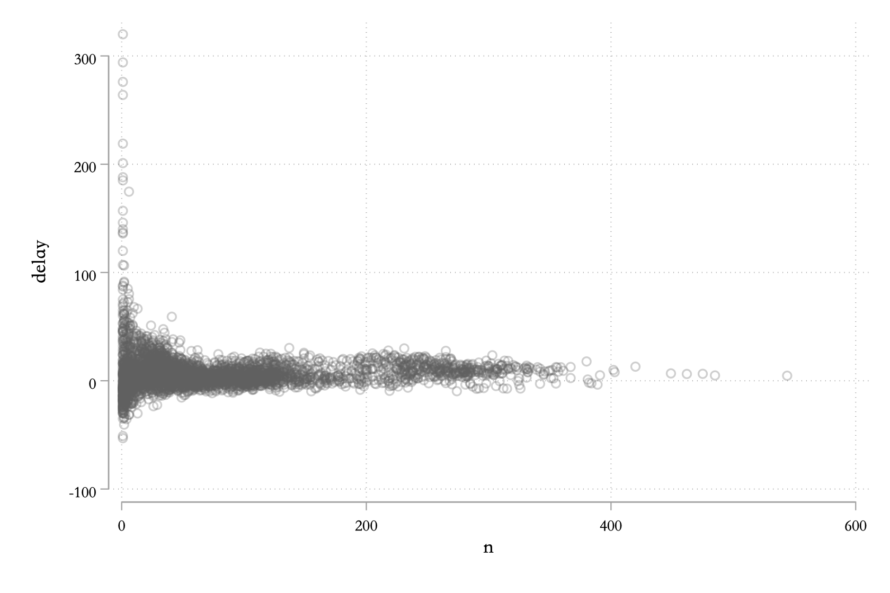
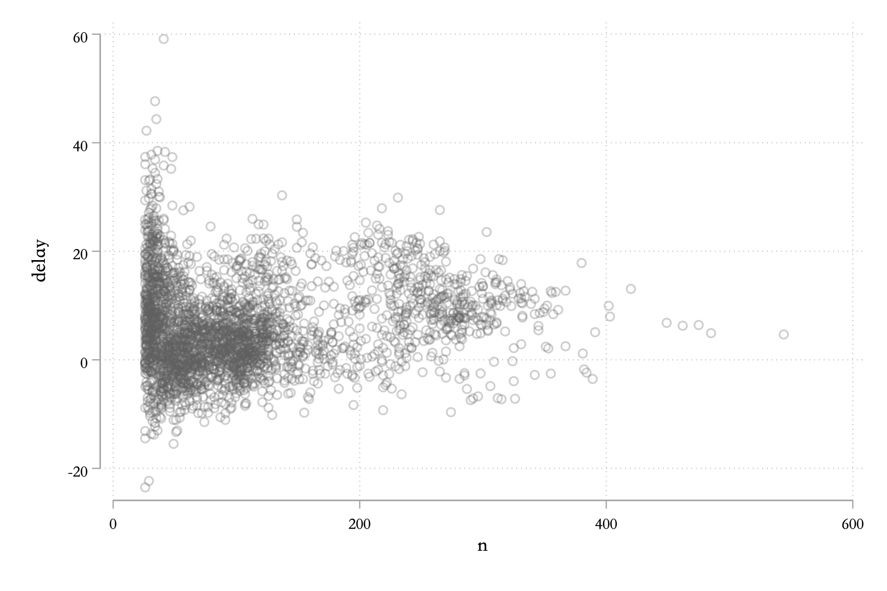
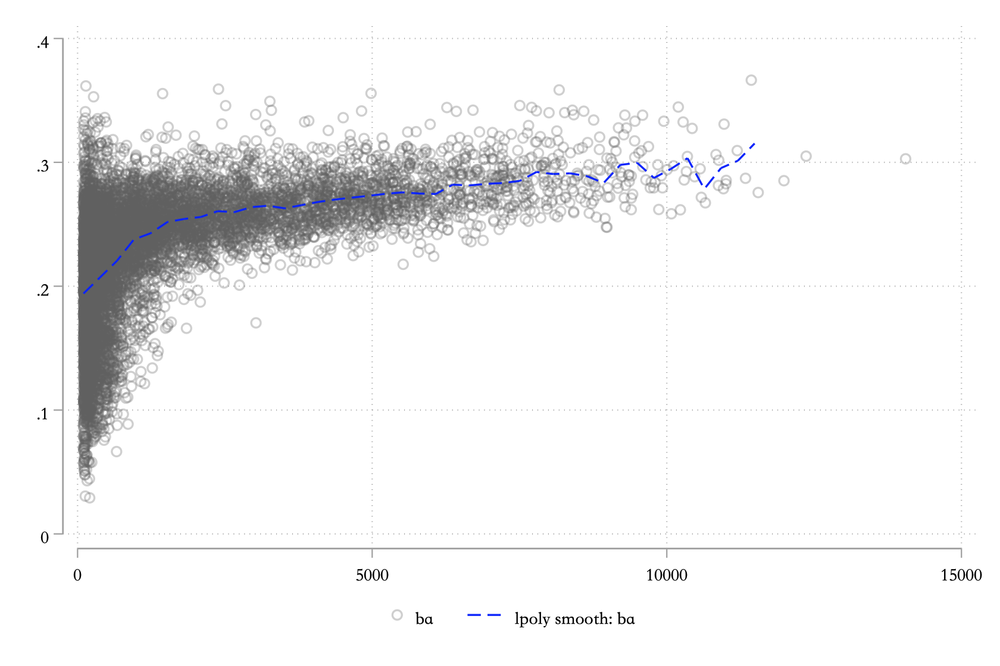

# 数据变形

图表是展示数据的重要工具，但是进行研究时拿到的第一手数据往往是无法直接进行绘图的，通常你需要进行适当的数据变形，例如对数据进行汇总或者生成一些新的变量。本章将介绍如何对数据进行变形。

## nycflights13 数据集

这个数据集包含了2013年从纽约市出发的  336,776 个航班，这些数据集来自美国[运输统计局](http://www.transtats.bts.gov/DatabaseInfo.asp?DB_ID=120&Link=0)：

```stata 
use nycflights13, clear
des

*> Contains data from nycflights13.dta
*>   obs:       336,776                          
*>  vars:            19                          29 Apr 2019 09:57
*>  size:    34,351,152                          
*> ---------------------------------------------------------------
*>               storage   display    value
*> variable name   type    format     label      variable label
*> ---------------------------------------------------------------
*> year            long    %12.0g                
*> month           long    %12.0g                
*> day             long    %12.0g                
*> dep_time        long    %12.0g                
*> sched_dep_time  long    %12.0g                
*> dep_delay       double  %10.0g                
*> arr_time        long    %12.0g                
*> sched_arr_time  long    %12.0g                
*> arr_delay       double  %10.0g                
*> carrier         str2    %-9s                  
*> flight          long    %12.0g                
*> tailnum         str6    %-9s                  
*> origin          str3    %-9s                  
*> dest            str3    %-9s                  
*> air_time        double  %10.0g                
*> distance        double  %10.0g                
*> hour            double  %10.0g                
*> minute          double  %10.0g                
*> time_hour       double  %tc                   
*> ---------------------------------------------------------------
```

## 筛选

keep 和 drop 命令允许你对数据集进行筛选，例如我们保留1月1日的所有航班：

```stata 
keep if month == 1 & day == 1
* 等价于
drop if month != 1 | day != 1
```

再例如，我们保存11月和12月的航班：

```stata 
keep if month == 11 | month == 12
* 等价于
drop if month != 11 & month != 12
```

逻辑运算遵循 De Morgan 定律：`!(x & y) 等于 !x | !y`

## 缺失值

Stata中有27个数值型缺失值，其中`.`是系统缺失值（system missing value）或`sysmiss`，而剩下的26个`.a, .b, .c, ···, .z `被称为扩展缺失值（extended missing values），这些拓展缺失值的作用是帮助使用者更好的跟踪缺失值。

Stata中实数的大小顺序为：

$$
非缺失值 < . < .a < .b <  ...  < .z
$$

而Stata中字符串的缺失值只有一种，也就是""。

```stata
clear all
set obs 10
gen x = .
gen y = ""
gen a = missing(x)
gen b = missing(y)
list
*>     +---------------+
*>     | x   y   a   b |
*>     |---------------|
*>  1. | .       1   1 |
*>  2. | .       1   1 |
*>  3. | .       1   1 |
*>  4. | .       1   1 |
*>  5. | .       1   1 |
*>     |---------------|
*>  6. | .       1   1 |
*>  7. | .       1   1 |
*>  8. | .       1   1 |
*>  9. | .       1   1 |
*> 10. | .       1   1 |
*>     +---------------+
```

```stata 
clear all
set obs 3
gen a = .
replace a = 1 in 1
replace a = 3 in 3
keep if missing(a) | a > 1
list
*>    +---+
*>    | a |
*>    |---|
*> 1. | . |
*> 2. | 3 |
*>    +---+
```

## 排列

### 列排序

列排序的意义不大，主要是把我们最关心的一些列排在前几列方便我们观察：

```stata 
use nycflights13, clear
order year month day
```

这样就能把 year month day 三个变量排在前三列了。

### 行排序

行排序可以让我们更容易看到变量的极值：

```stata 
* 顺序
gsort dep_time
* 逆序
gsort -dep_time
```

多变量排序：

```stata 
gsort dep_time -sched_dep_time
```

由于缺失值大于所有非缺失值，所以顺序排列的时候缺失值排在最后一行。

## 选择

选择变量同样可以使用 keep 和 drop 实现，例如只保留 year month day 变量：

```stata 
keep year month day
* 或者
drop dep_time - time_hour
```

`dep_time - time_hour` 表示 `dep_time` 到 `time_hour` 的所有变量。

变量选择可以使用通配符，例如保留所有开头为 a 的变量：

```stata 
use nycflights13, clear
keep a*
```

保留所有结尾为 y 的变量：

```stata 
use nycflights13, clear
keep *y
```

保留所有变量名中含 a 的变量：

```stata 
use nycflights13, clear
keep *a*
```

## 变量重命名

变量重命名使用 rename 命令，例如根据 year month day 变量生成 date 变量，再把 date 变量重命名为 `日期`：

```stata 
use nycflights13, clear
gen tempdate = string(year) + "-" + string(month) + "-" + string(day)
gen date = date(tempdate, "YMD")
order date
format date %tdCY-N-D
drop tempdate
ren date 日期
```

## 生成新的变量

```stata 
use nycflights13, clear
keep year - day *delay distance air_time
gen gain = dep_delay - arr_delay
gen speed = distance / air_time * 60
```

你可以继续使用刚刚生成的新列：

```stata 
gen hours = air_time / 60
gen gain_per_hour = gain / hours
```

一些有用的函数：

```stata 
use nycflights13, clear
keep dep_time
* 整除
gen hour = int(dep_time / 100)
* 取余
gen minute = mod(dep_time, 100)
```

滞后与领先：

```stata 
use nycflights13, clear
gen tempdate = string(year) + "-" + string(month) + "-" + string(day)
gen date = date(tempdate, "YMD")
order date
format date %tdCY-N-D
drop tempdate

duplicates drop date, force
tsset date
keep date dep_time
gen lag = l.dep_time
gen lead = f.dep_time
```

累计求和：

```stata 
clear all
set obs 10
gen x = _n
gen cumsum = sum(x)
gen cummean = sum(x) / x
list
*>     +----------------------+
*>     |  x   total   cummean |
*>     |----------------------|
*>  1. |  1       1         1 |
*>  2. |  2       3       1.5 |
*>  3. |  3       6         2 |
*>  4. |  4      10       2.5 |
*>  5. |  5      15         3 |
*>     |----------------------|
*>  6. |  6      21       3.5 |
*>  7. |  7      28         4 |
*>  8. |  8      36       4.5 |
*>  9. |  9      45         5 |
*> 10. | 10      55       5.5 |
*>     +----------------------+
```

排名函数：

```stata 
clear all
set obs 6
gen x = 2
replace x = 1 in 1
replace x = . in 4
replace x = 3 in 5
replace x = 4 in 6
egen rank1 = rank(x), field
egen rank2 = rank(x), track
egen rank3 = rank(x), unique
list

*>    +---------------------------+
*>    | x   rank1   rank2   rank3 |
*>    |---------------------------|
*> 1. | 1       5       1       1 |
*> 2. | 2       3       2       2 |
*> 3. | 2       3       2       3 |
*> 4. | .       .       .       . |
*> 5. | 3       2       4       4 |
*>    |---------------------------|
*> 6. | 4       1       5       5 |
*>    +---------------------------+
```

## 分组汇总

求 dep_delay 变量的均值：

```stata 
use nycflights13, clear
sum dep_delay
*>     Variable |        Obs        Mean    Std. Dev.       Min        Max
*> -------------+---------------------------------------------------------
*>    dep_delay |    328,521    12.63907    40.21006        -43       1301
```

求每一天 dep_delay 变量的均值。

方法一（tabstat）：

```stata 
use nycflights13, clear
sum dep_delay

gen tempdate = string(year) + "-" + string(month) + "-" + string(day)
gen date = date(tempdate, "YMD")
order date
format date %tdCY-N-D
drop tempdate

tabstat dep_delay, by(date) stat(mean) nototal save

*> Summary for variables: dep_delay
*>      by categories of: date
*>      date |      mean
*> ----------+----------
*> 2013-01-01 |  11.54893
*> 2013-01-02 |  13.85882
*> 2013-01-03 |  10.98783
*> 2013-01-04 |  8.951595
*> 2013-01-05 |  5.732218
*> 2013-01-06 |  7.148014
*> 2013-01-07 |  5.417204
*> 2013-01-08 |  2.553073
*> ······
*> 2013-12-24 |  6.765957
*> 2013-12-25 |  7.552448
*> 2013-12-26 |   14.4172
*> 2013-12-27 |  10.93763
*> 2013-12-28 |   7.98155
*> 2013-12-29 |  22.30955
*> 2013-12-30 |  10.69811
*> 2013-12-31 |  6.996053
*> ---------------------
```

方法二（sumup）：

```stata
use nycflights13, clear
sumup dep_delay, by(year month day) statistics(mean) save(temp.dta) replace
use temp, clear
list in 1/10

*>     +-------------------------------+
*>     | year   month   day       mean |
*>     |-------------------------------|
*>  1. | 2013       1     1   11.54893 |
*>  2. | 2013       1     2   13.85882 |
*>  3. | 2013       1     3   10.98783 |
*>  4. | 2013       1     4   8.951595 |
*>  5. | 2013       1     5   5.732218 |
*>     |-------------------------------|
*>  6. | 2013       1     6   7.148015 |
*>  7. | 2013       1     7   5.417204 |
*>  8. | 2013       1     8   2.553073 |
*>  9. | 2013       1     9   2.276477 |
*> 10. | 2013       1    10   2.844995 |
*>     +-------------------------------+
```

### 观察航班里程和航班延误时间的关系

图 \@ref(fig:delaydist) 展示了航班里程和航班延误时间的关系：

```stata 
use nycflights13, clear
bysort dest: gen count = _N 
bysort dest: egen dist = mean(dist)
bysort dest: egen delay = mean(arr_delay)
keep if count > 20 & dest != "HNL"
duplicates drop dest, force

tw ///
sc delay dist [fw = count], msize(*0.3) || ///
lpoly delay dist, lc(blue) bw(300) ||, ///
leg(pos(6) order(1 "局部多项式拟合")) ///
note(散点半径表示该天的航班数)
```

这里使用 `lpoly` 命令进行局部多项式拟合，`bw()` 选项用于选择带宽，其数值越大曲线越平滑。

```{r delaydist, echo=FALSE, fig.align='center', fig.cap='航班里程和航班延误时间的关系', out.width='80%', fig.align='center'}
knitr::include_graphics('assets/delaydist.png')
```

不同于 R 语言，Stata 中不能方便的建立各种映射，这里我是使用 fw 频率权重将 count 变量展示为散点的大小。你会发现这个映射是没有图例的。


### 缺失值的处理

我们可以预先删除含有缺失值的变量：

```stata 
use nycflights13, clear
drop if missing(dep_delay) | missing(arr_delay)
bysort year month day: egen mean = mean(dep_delay)
duplicates drop year month day, force
list year month day mean in 1/5

*>    +-------------------------------+
*>    | year   month   day       mean |
*>    |-------------------------------|
*> 1. | 2013       1     1   11.43562 |
*> 2. | 2013       1     2    13.6778 |
*> 3. | 2013       1     3   10.90778 |
*> 4. | 2013       1     4   8.965859 |
*> 5. | 2013       1     5   5.732218 |
*>    +-------------------------------+
```

### 观测值计数

对数据进行分组汇总的时候，最好包括观测值的数量或非缺失观测值的数量。这样，您可以检查您的结论是否是根据非常少量的数据得出的。例如，让我们看一下不同尾号的飞机的平均延迟时间的分布，见图 \@ref(fig:kdensitydelay)：

```stata 
use nycflights13, clear
drop if missing(dep_delay) | missing(arr_delay)
bysort tailnum: egen delay = mean(arr_delay)
duplicates drop tailnum, force
kdensity delay
```

```{r kdensitydelay, echo=FALSE, fig.align='center', fig.cap='不同尾号的飞机的平均延迟时间的分布', out.width='80%', fig.align='center'}

```

可以看到，有些型号的飞机可能延迟 >300 分钟！

如果我们绘制航班数量与平均延误的散点图，我们可以发现更多的东西：

```stata 
use nycflights13, clear
drop if missing(dep_delay) | missing(arr_delay)
bysort tailnum: egen delay = mean(arr_delay)
bysort tailnum: gen n = _N
duplicates drop tailnum, force
tw sc delay n, mc(%30)
```

```{r scdelayn, echo=FALSE, fig.align='center', fig.cap='航班数量与平均延误的散点图', out.width='80%', fig.align='center'}

```

从 \@ref(fig:scdelayn) 中我们可以看到当航班很少的时候，平均延误的波动会很大，当然这其实是大数定律。

观测值很少的平均数往往是没有太多意义的，所以很多时候我们会过滤掉这些观测值很少的点：

```stata 
use nycflights13, clear
drop if missing(dep_delay) | missing(arr_delay)
bysort tailnum: egen delay = mean(arr_delay)
bysort tailnum: gen n = _N
duplicates drop tailnum, force
tw sc delay n if n > 25, mc(%30)
```

```{r scdelayn2, echo=FALSE, fig.align='center', fig.cap='航班数量与平均延误的散点图（过滤掉观测值很少的散点）', out.width='80%', fig.align='center'}

```

这种模式还有另一种常见的变化。让我们来看看棒球击球手的平均表现如何与他们击球的次数有关：

```stata 
use batting, clear
bysort playerID: egen temp1 = sum(H)
bysort playerID: egen temp2 = sum(AB)
gen ba = temp1 / temp2
bysort playerID: egen ab = sum(AB)
drop temp*
keep if ab > 100
duplicates drop playerID, force
tw ///
sc ba ab, mc(%30) || ///
lpoly ba ab, lc(blue) ||, ///
leg(pos(6) rows(1))
```

```{r scbaab, echo=FALSE, fig.align='center', fig.cap='棒球击球手的平均表现与他们击球的次数的关系', out.width='80%', fig.align='center'}

```

可以看到，击球次数越多的击球手表现越稳定，表现也越好。

### 有用的汇总函数

这部分内容可以参考 Stata 的相关帮助文档：

```stata 
help egen 
search egenmore
search egenmisc
```

或者参考我的网站博客：[Stata中的egen函数](https://www.czxa.top/posts/18884/)。

### 按多变量分组

前文中我大量使用了 by/bysort 进行分组聚合，关于 by/bysort 的更多用法可以参考帮助文档：`help by`。


